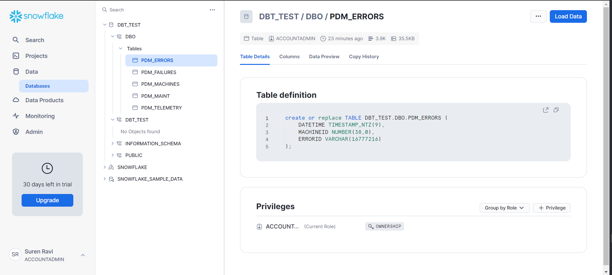
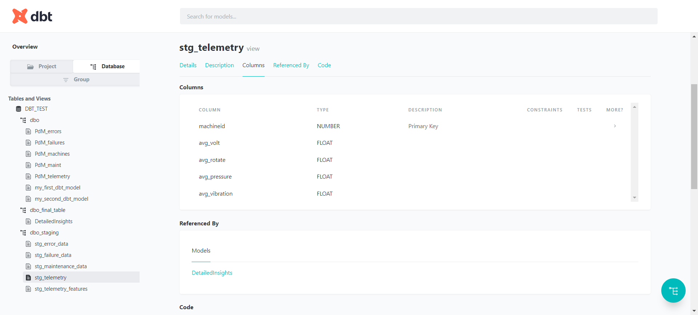

# Problem Statement
### - Push the data from local storage tp snowflake database
### - To push the data from local storage use DBT
### - Use DBT to run and test sql and yml files
### - Deploy the DBT docs and dashboard to vercel

### DBT-Snowflake Dashbard Link: https://dbt-snowflake-integration.vercel.app/

## Architecture:

## DBT + Snowflake Connection Test:

## Snowflake Pipeline:

1. Snowflake Dashboard:

2. Data Insertion using dbt seed from local storage to snowflake database

3. Data Preview (Snowflake UI)
PDM_Errors:

....
PDM_MAINT

4. 

## Transformed Data (Staging Data  -> Table)
### - [Staging Data](snowflake_dbt_integration/models/staging) (view): stg_error_data ,...., stg_telemetry_features
### - [table](snowflake_dbt_integration/models/final_tables): DetailedInsights
## View data 
[1] 
## Table data
[1] 
[2] 

## CI/CD:
### - DBT Doc Generation: dbt docs generate
### - DBT Doc Serve: dbt docs serve
### DBT DBO:

### DBT Table:

### DBT View / Staging:

